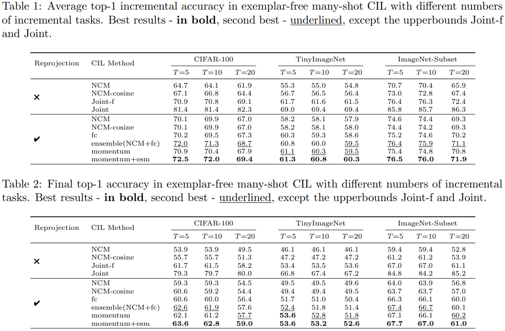

<div align="center">
<h1>Official code for "FRMM: Feature Reprojection for Exemplar-Free Class-Incremental Learning". ICIC2024, oral accepted.</h1>
</div>

## Result

<div align="center">

</div>
We save a **prototype** and a **standard deviation** for each class. 

**Do not recommend storing the covariance matrix, as it requires storage space hundreds of times larger than storing just the prototype, which even exceeds many exemplar-based methods.**

The experimental results show that freezing the feature extractor severely limits the model's capability, making it difficult for further improvement.

## Dataset

1. For CIFAR-100, the dataset needs to be placed in the `./data/CIFAR/` . Otherwise, it will be automatically downloaded by PyTorch.

2. For TinyImageNet, the dataset needs to be placed in the `data/tiny-imagenet-200/` . The dataset can be find at https://www.kaggle.com/datasets/akash2sharma/tiny-imagenet.

   Code to read TinyImageNet will be like:

   ```python
   torchvision.datasets.ImageFolder("./data/tiny-imagenet-200/train/")
   torchvision.datasets.ImageFolder("./data/tiny-imagenet-200/val/")
   ```

3. For ImageNet-Subset, the dataset needs to be placed in the `data/imagenet100/` . The dataset can be find at https://www.kaggle.com/datasets/arjunashok33/imagenet-subset-for-inc-learn.

   ! We set `--batch_size=384` for faster training.

## Our contributions

### 1. Feature Reprojection

Use a reprojector layer between the feature extractor (Resnet18, etc) and the classifier (fc).

The feature extractor is frozen after the initialization phase (task 0).

The reprojector can significantly improve accuracy and correct biases of the frozen feature extractor towards old classes, demonstrating greater plasticity.

The reprojector will slightly lower the initial accuracy, but the forgetting in increment stage is also less.

However, the accuracy of classes in last task will be higher than previous classes, which means the balance of  stability and plasticity is still not very good.

### 2. Ensemble  the logits of fc and NCM

logits<sub>fc</sub>, logits<sub>ncm</sub> --> Softmax --> average

NCM has better stability, fc has better plasticity, so why not ensemble both.

This ensemble is zero cost, and achieves higher accuracy and a more balanced result.

### 3. Update the fc classifier with momentum.

Momentum updating will only be applied to weights directly associated with the old classes, which means w[0:n_old_classes] and bias[0:n_old_classes].

This will also achieves higher accuracy and a more balanced result.

## Run

```bash
python main.py --config=exps/[CONFIG_FILE].json
```

Some parameters can be specified via command-line arguments, overriding the settings in the configuration file. Details can be find in `main.py`.

### Common Hyperparameters

- `prefix`: `str` The prefix of logs and saved filename.
- `dataset`: `str`
  - `"cifar100"`
  - `"tinyimagenet200"`
- `shuffle`: `bool` Whether to shuffle the learning order of classes.
- `init_cls`: `int` The number of classes in the initial stage.
- `increment`: `int` The number of classes in each incremental stage.
- `model_name`: `str` The incremental learning method to run. See `models/` for detail.
- `convnet_type`: `str` Which backbone to use. See `convs/` and `utils/inc_net.py` for detail.
- `initial_model_path`: `str | None` If set, the initial stage will be skipped. Instead, the model will load weights from this path. It will be helpful when only parameters of incremental stages are changed.
- `device`: `list of str` Multi-GPU training is currently unavailable, so please only specify the GPU that you intend to use.
- `seed`: `list of int`  Train using each seed in the list sequentially. [1993] to reproduce our result.
- `init_epochs`: `int` Epochs for the initial stage.
- `init_lr`: `float` Learning rate for the initial stage.
- `init_weight_decay`: `float` Weight decay for the initial stage.
- `epochs`: `int` Epochs for the incremental stage.
- `lr`: `float` Learning rate for the incremental stage.
- `weight_decay`: `float` Weight decay for the incremental stage.
- `batch_size`: `int` 128 for CIFAR-100 and TinyImageNet, 384 for ImageNet-Subset.
- `num_workers`: `int`
- `pin_memory`: `bool`

**Other parameters can find in `models/[METHOD].py`**

## Our code references the the following repository:

[PyCIL](https://github.com/G-U-N/PyCIL), [FeCAM](https://github.com/dipamgoswami/FeCAM)

